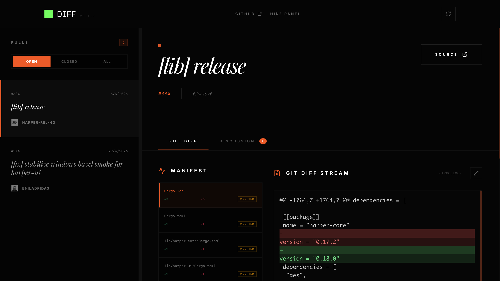

# DIFF

| **Project** | **Details** |
|-------------|-------------|
| Name | DIFF |
| Version | v0.1.0 |
| Product Of | [harpertoken](https://github.com/harpertoken) |
| Repository | [harper](https://github.com/harpertoken/harper) |
| Description | Pull request review tool |
| Architecture | React, Tailwind CSS, GitHub API |
| Features | Dual-pane, syntax highlighting, real-time diff |
| CI | TS check, YAML lint, pre-commit |

## Screenshot

  

## Disclaimer

DIFF is a product of harpertoken. The application is hosted at the harper repository. Users are responsible for their own environment configurations and the security of any sensitive data accessed during their sessions.
